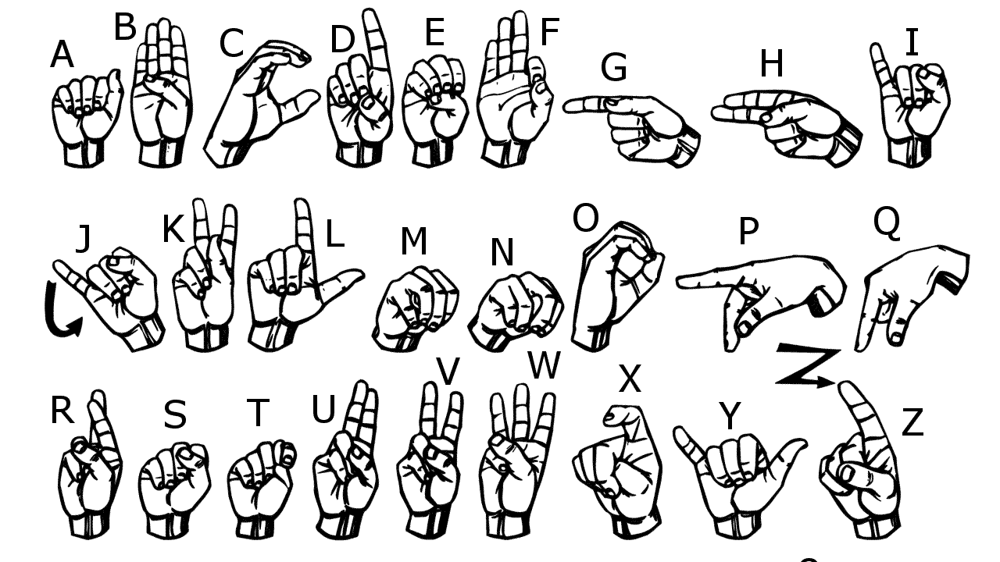

**Sign-Language-To-Text-and-Speech-Conversion**

**ABSTRACT:** 

Sign language is a fundamental mode of communication, especially for individuals who are deaf or hard of hearing. Our project aims to create a real-time system that utilizes neural networks to interpret American Sign Language (ASL) finger-spelling gestures. By employing a Convolutional Neural Network (CNN), our method recognizes hand gestures captured by a camera. The system processes hand positions and orientations to generate training and testing data, which are then used to train the CNN. The hand images are filtered, classified, and calibrated to enhance recognition accuracy. 

The Final Outcome Of Our Project...

**Introduction:**

 American Sign Language (ASL) is a primary mode of communication for the deaf and hard of hearing community. Since spoken language is not an option for these individuals, sign language serves as a crucial means of conveying thoughts and messages. This project focuses on developing a model capable of recognizing ASL finger-spelling gestures and converting them into text and audio. The ultimate goal is to bridge communication gaps between those who use sign language and those who do not. 

**Requirements:**

More than 70 million deaf people around the world use sign languages to communicate. Sign language allows them to learn, work, access services, and be included in the communities.  

It is hard to make everybody learn the use of sign language with the goal of ensuring that people with disabilities can enjoy their rights on an equal basis with others. 

So, the aim is to develop a user-friendly human computer interface (HCI) where the computer understands the American sign language This Project will help the dumb and deaf people by making their life easy. 

**Objective:**
To create a computer software and train a model using CNN which takes an image of hand gesture of American Sign Language and shows the output of the particular sign language in text format converts it into audio format. 

**Scope:**
This System will be Beneficial for Both Dumb/Deaf People and the People Who do not understands the Sign Language. They just need to do that with sign Language gestures and this system will identify what he/she is trying to say after identification it gives the output in the form of Text as well as Speech format. 

**Data Acquisition :**

The different approaches to acquire data about the hand gesture can be done in the following ways: 

It uses electromechanical devices to provide exact hand configuration, and position. Different glove-based approaches can be used to extract information. But it is expensive and not user friendly. 

In vision-based methods, the computer webcam is the input device for observing the information of hands and/or fingers. The Vision Based methods require only a camera, thus realizing a natural interaction between humans and computers without the use of any extra devices, thereby reducing costs.  The main challenge of vision-based hand detection ranges from coping with the large variability of the human hand’s appearance due to a huge number of hand movements, to different skin-color possibilities as well as to the variations in viewpoints, scales, and speed of the camera capturing the scene.

 

**Data pre-processing and Feature extraction:**

In this approach for hand detection, firstly we detect hand from image that is acquired by webcam and for detecting a hand we used media pipe library which is used for image processing. So, after finding the hand from image we get the region of interest (Roi) then we cropped that image and convert the image to gray image using OpenCV library after we applied the gaussian blur .The filter can be easily applied using open computer vision library also known as OpenCV. Then we converted the gray image to binary image using threshold and Adaptive threshold methods. 

We have collected images of different signs of different angles  for sign letter A to Z. 

- in this method there are many loop holes like your hand must be ahead of clean soft background and that is in proper lightning condition then only this method will give good accurate results but in real world we dont get good background everywhere and we don’t get good lightning conditions too. 

So to overcome this situation we try different approaches then we reached at one interesting solution in which firstly we detect hand from frame using mediapipe and get the hand landmarks of hand present in that image then we draw and connect those landmarks in simple white image  

Now we get this landmark points and draw it in plain white background using opencv library 

-By doing this we tackle the situation of background and lightning conditions because the mediapipe labrary will give us landmark points in any background and mostly in any lightning conditions. 

-we have collected 180 skeleton images of Alphabets from A to Z 

**Gesture Classification :**

**Convolutional Neural Network (CNN)**

CNN is a class of neural networks that are highly useful in solving computer vision problems. They found inspiration from the actual perception of vision that takes place in the visual cortex of our brain. They make use of a filter/kernel to scan through the entire pixel values of the image and make computations by setting appropriate weights to enable detection of a specific feature. CNN is equipped with layers like convolution layer, max pooling layer, flatten layer, dense layer, dropout layer and a fully connected neural network layer. These layers together make a very powerful tool that can identify features in an image. The starting layers detect low level features that gradually begin to detect more complex higher-level features 

 

Unlike regular Neural Networks, in the layers of CNN, the neurons are arranged in 3 dimensions: width, height, depth. 

The neurons in a layer will only be connected to a small region of the layer (window size) before it, instead of all of the neurons in a fully-connected manner. 

Moreover, the final output layer would have dimensions(number of classes), because by the end of the CNN architecture we will reduce the full image into a single vector of class scores. 

CNN 

**Convolutional Layer:**

In convolution layer I have taken a small window size [typically of length 5*5] that extends to the depth of the input matrix. 

The layer consists of learnable filters of window size. During every iteration I slid the window by stride size [typically 1], and compute the dot product of filter entries and input values at a given position. 

As I continue this process well create a 2-Dimensional activation matrix that gives the response of that matrix at every spatial position. 

That is, the network will learn filters that activate when they see some type of visual feature such as an edge of some orientation or a blotch of some colour. 

**Pooling Layer:**

We use pooling layer to decrease the size of activation matrix and ultimately reduce the learnable parameters. 

There are two types of pooling: 

   **a. Max Pooling:**

In max pooling we take a window size [for example window of size 2*2], and only taken the maximum of 4 values. 

Well lid this window and continue this process, so well finally get an activation matrix half of its original Size. 

  **b. Average Pooling:** 

In average pooling we take average of all Values in a window. 

pooling 

**Fully Connected Layer:**

In convolution layer neurons are connected only to a local region, while in a fully connected region, well connect the all the inputs to neurons. 

Fully Connected Layer 

 

The preprocessed 180 images/alphabet will feed the keras CNN model.  

Because we got bad accuracy in 26 different classes thus, We divided whole 26 different alphabets into 8 classes in which every class contains similar alphabets: 
[y,j] 

[c,o] 

[g,h] 

[b,d,f,I,u,v,k,r,w] 

[p,q,z] 

[a,e,m,n,s,t] 

All the gesture labels will be assigned with a  

probability. The label with the highest probability will treated to be the predicted label. 

So when model will classify [aemnst] in one single class using mathematical operation on hand landmarks we will classify further into single alphabet a or e or m or n or s or t. 

-Finally, we got **97%** Accuracy (with and without clean background and proper lightning conditions) through our method. And if the background is clear and there is good lightning condition then we got even **99%** accurate results 

**Text To Speech Translation:**

The model translates known gestures into words. we have used pyttsx3 library to convert the recognized words into the appropriate speech. The text-to-speech output is a simple workaround, but it's a useful feature because it simulates a real-life dialogue. 

**Hardware Requirement:**

Webcam 

**Software Requirement:**

Operating System: Windows 8 and Above 

IDE: PyCharm 

Programming Language: Python 3.9 5 

Python libraries: OpenCV, NumPy, Keras,mediapipe,Tensorflow 
